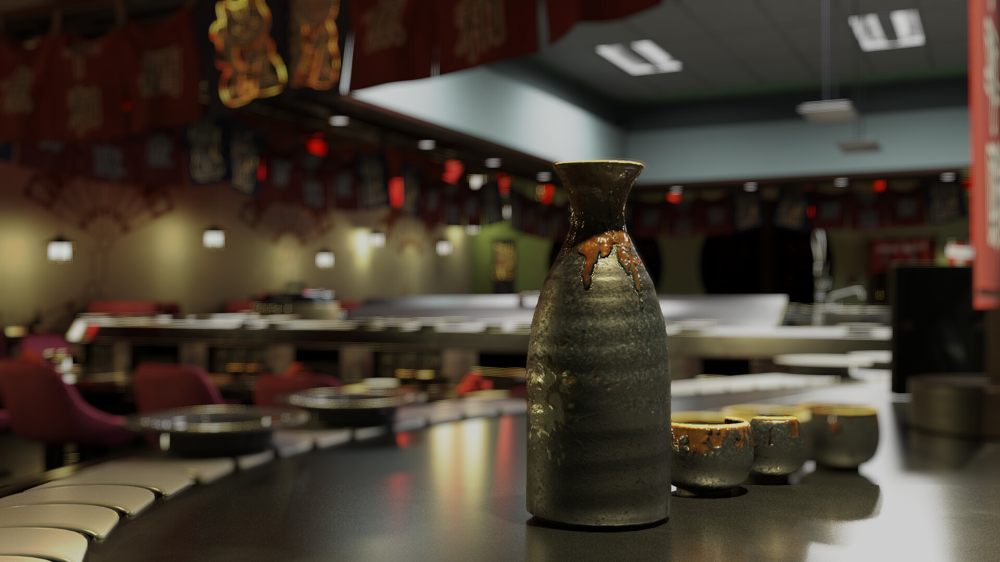
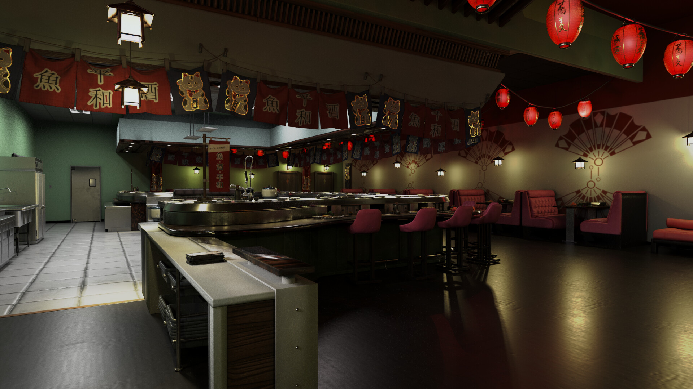
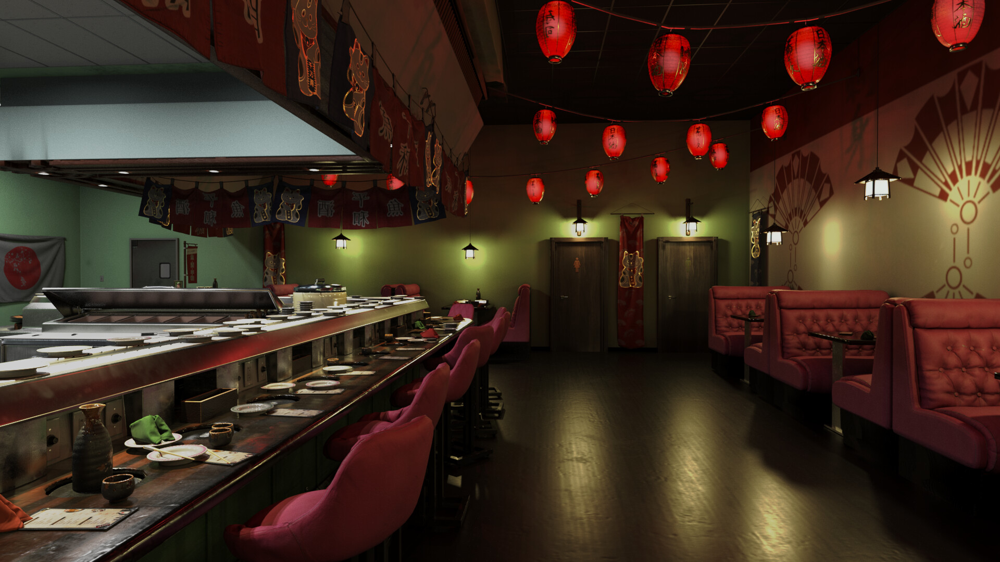
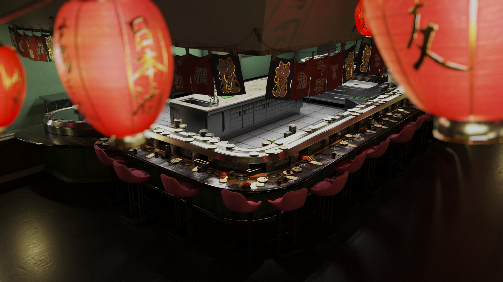
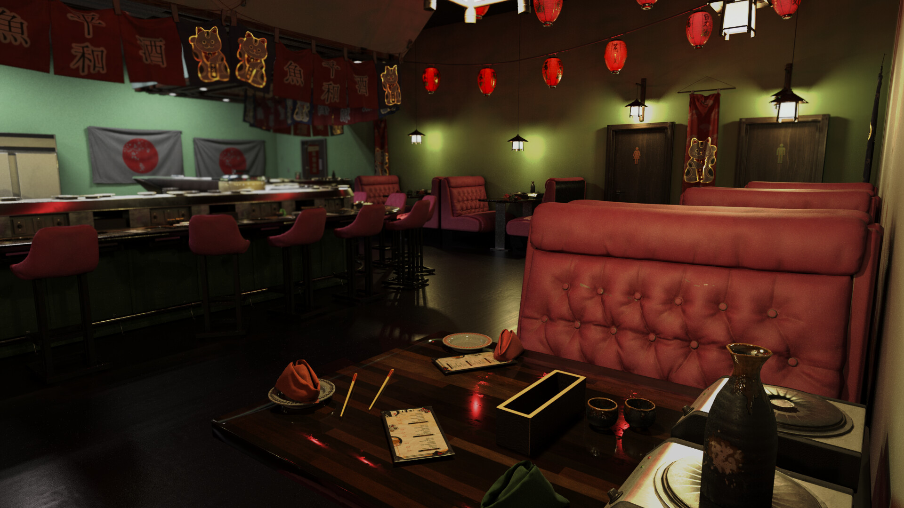
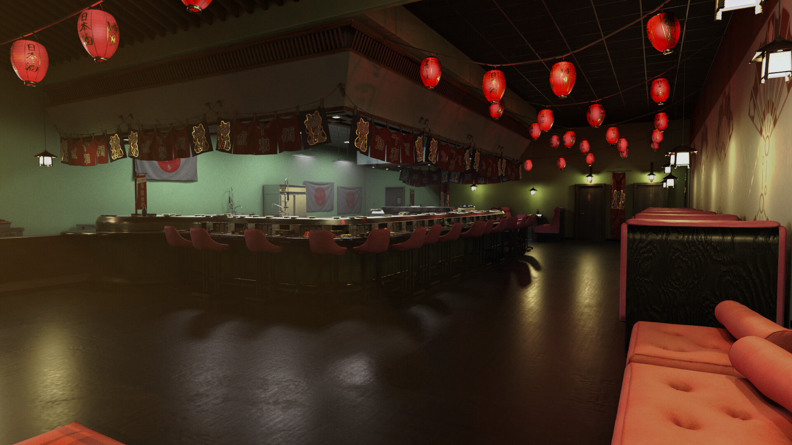
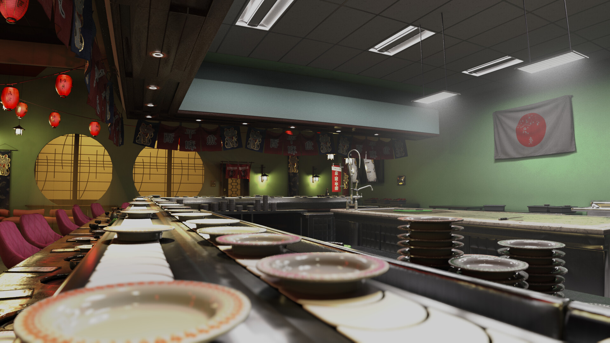

A chic sushi bar I made at ucf leading a team through every step of the process of making an environment. Almost all assets were geared for game engine use, and the project was rendered in Maya. Project deadline was 1 month.

 

 

 

 

 

 

 

{}

## Credits:

Levi Siewert: - Project Lead, Modeling, Texturing, Compositing

Tzu Su - Modeling, Lighting

Tin Nguyen - Design and Layout Team

Damita McCluster - Design and Layout Team

West McCann - Texturing