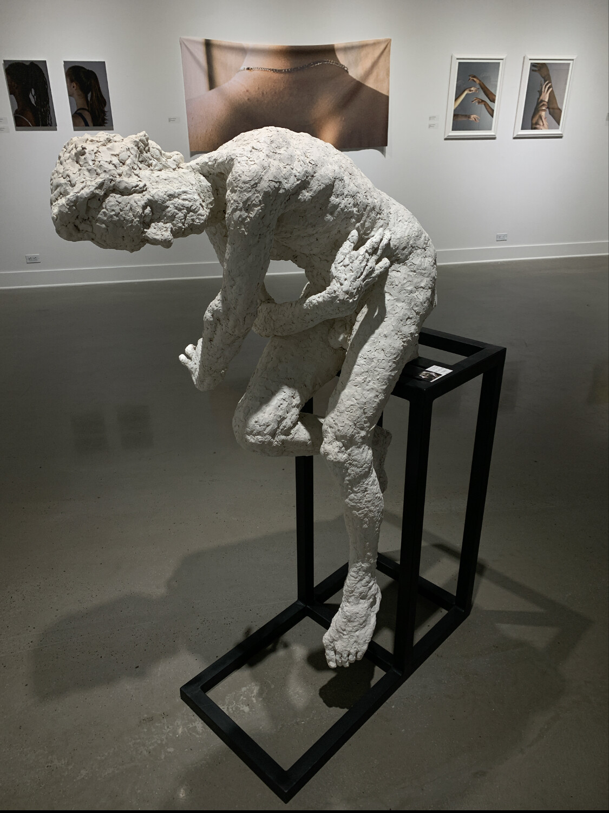
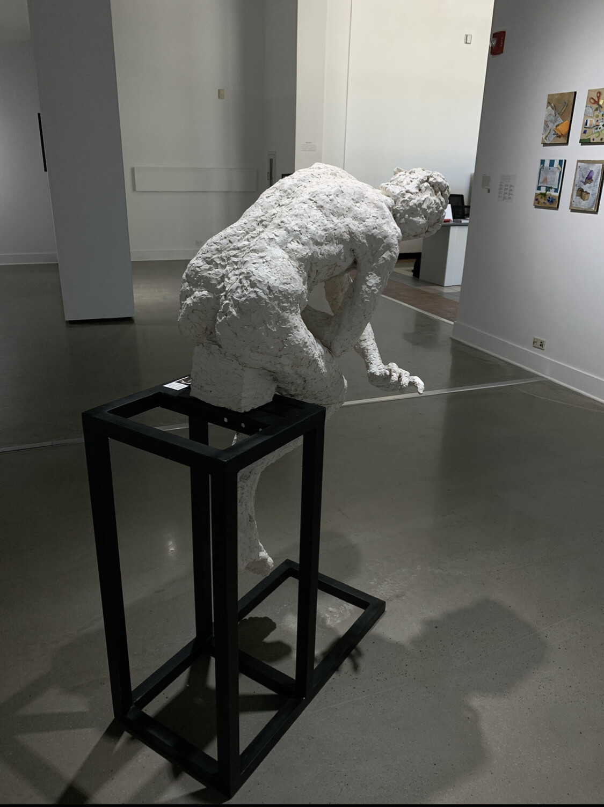
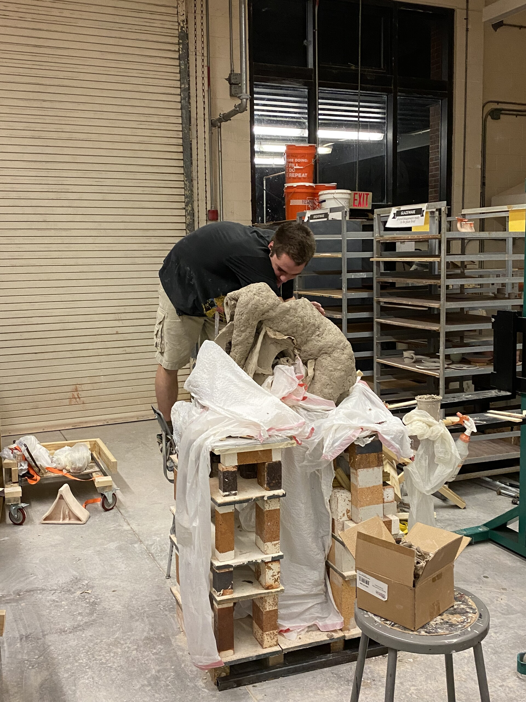
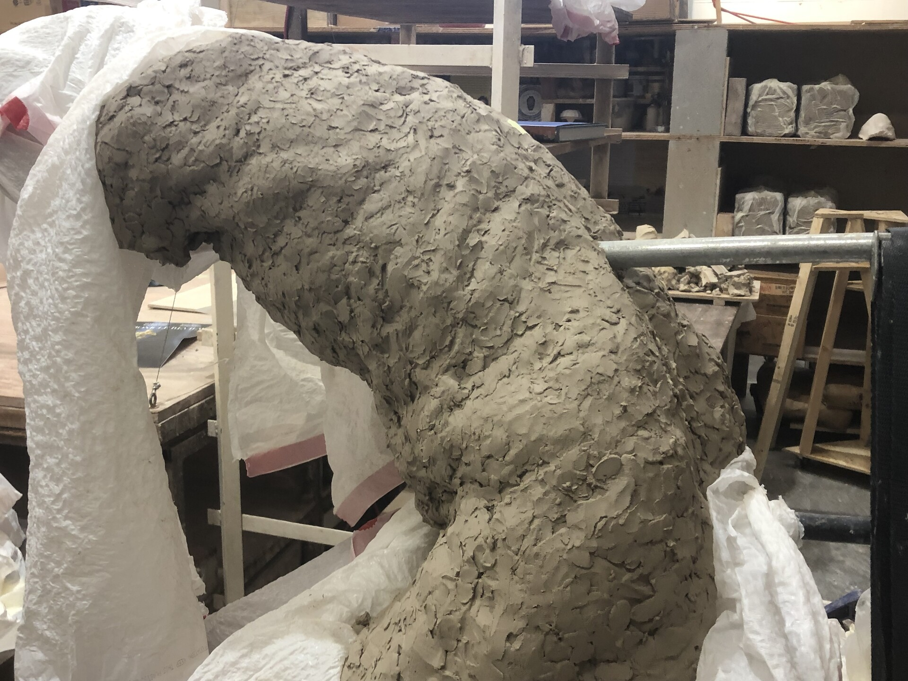
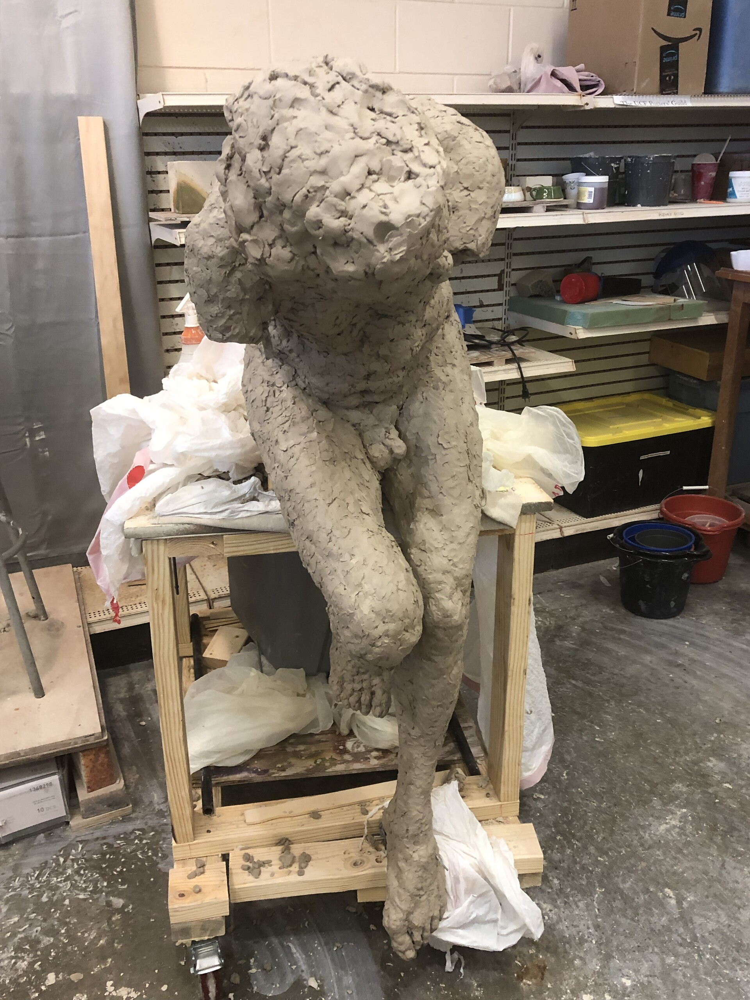
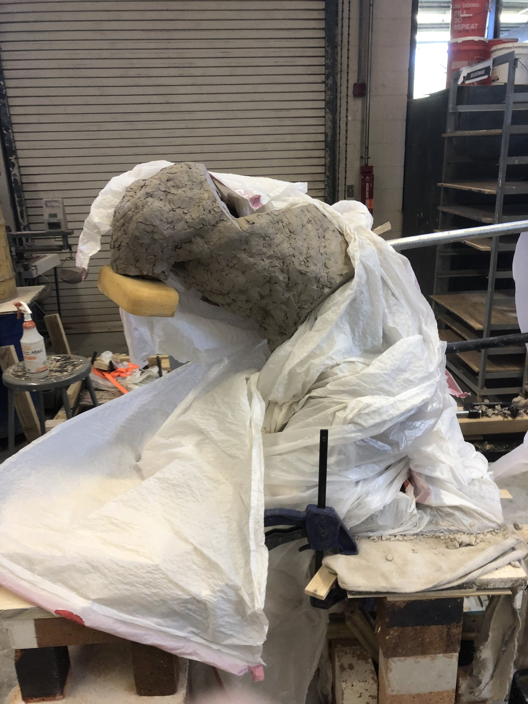
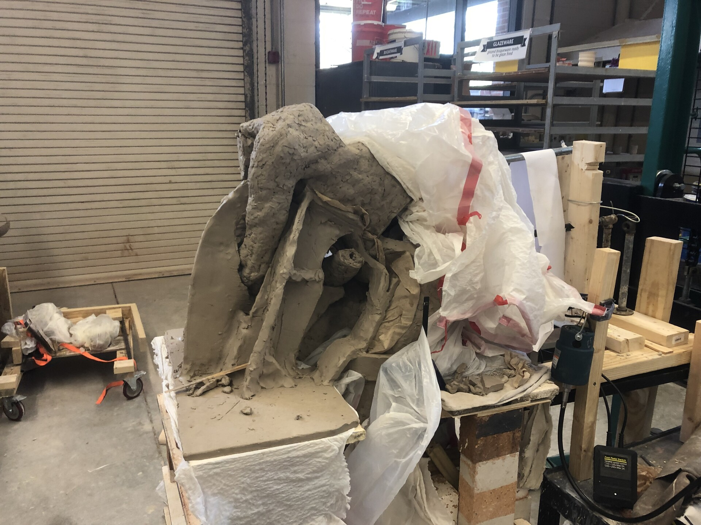
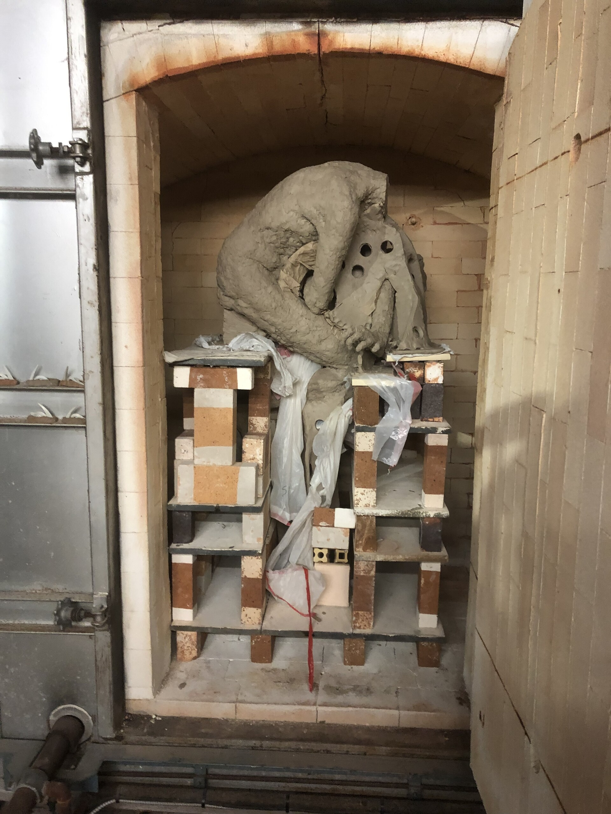

 

2022

Ceramic, Steel

Throne was my most extreme work while at UCF as a BFA.

A lifesize ceramic figure from an original clay body with two times where the figure was mostly destroyed and had to be reconstructed. Technical challenges at this scale and with such a pose with the intention of firing as 1-2 pieces are extreme. In the end the figure had to be deconstructed and fired in parts before being rejoined, but its still fun looking at the pictures and remembering the exorbitant effort.

 
 

 
 

 
 

<!-- COA Description:

Throne was the culmination of an intense effort of observation of the human figure born from an era of my life where sight was being initially developed. It reflects on the cradle of my mind and the movements of those that taught me, and the reflections of those before them. Though it was broken many times, this figure has been expounded from the mud and dust in which we come from. 

-->