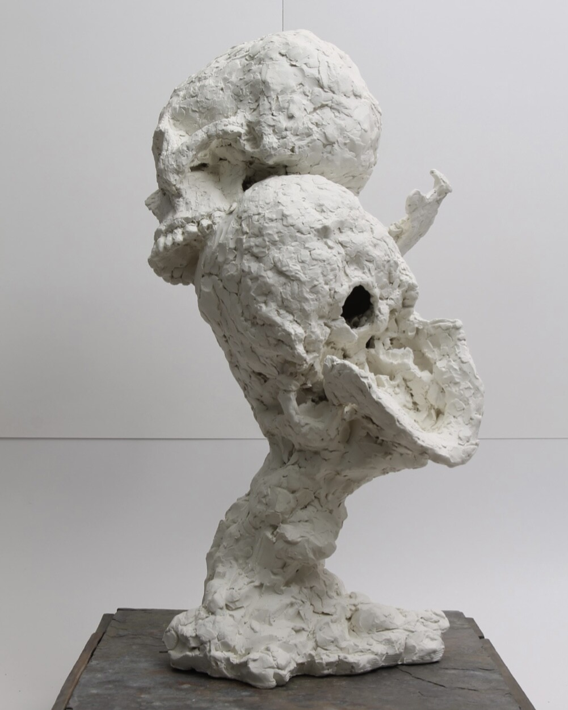
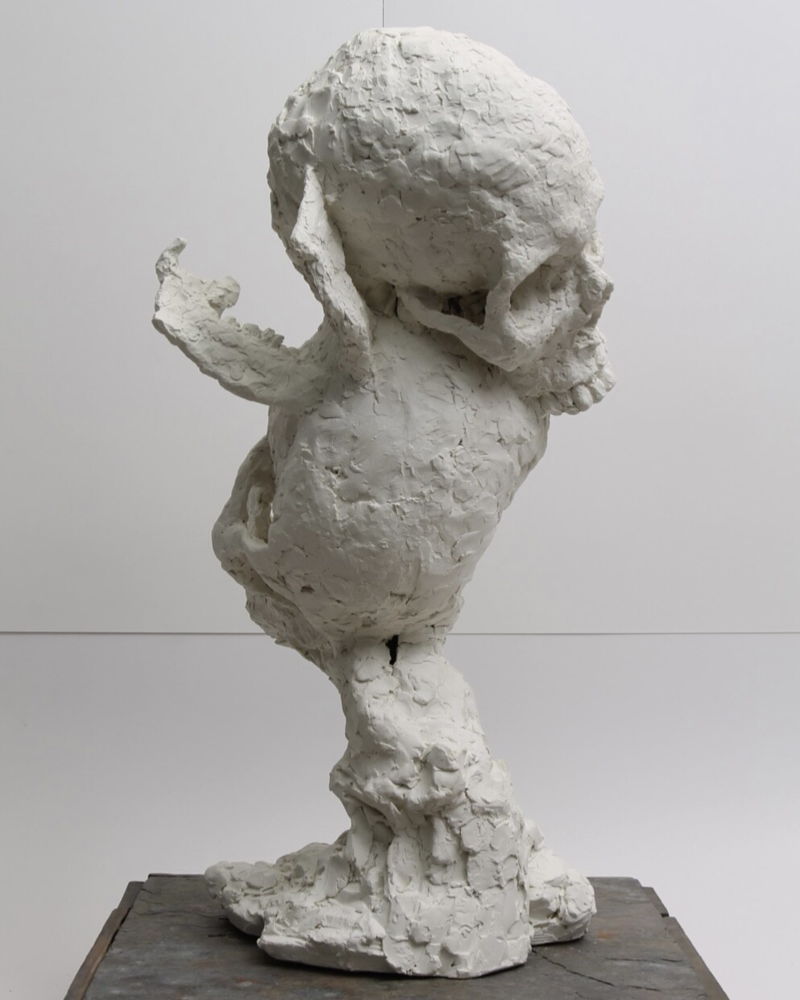

 

2021

Ceramic, Steel, Slate

12” x 12” x 22”

This piece, as the others I will upload shortly, was part of my BFA show as a Ceramic-Sculpture major through UCF. I wanted to explore overlapping truths through the concept that a pieces is a series of countless individual unique observations that do not do not have to coexist in relation to each other to produce a visually pleasing result. its was a reformation of a broken mold.
The piece was fired in low fire clay as a single entity.

<!-- COA caption:
Territory of Sight was the modern cradle of my observation in space and holds many of the seeds that germinated to the later thoughts and movements. It holds reflects an immeasurable value I hold for observation, the desire to exist. -->