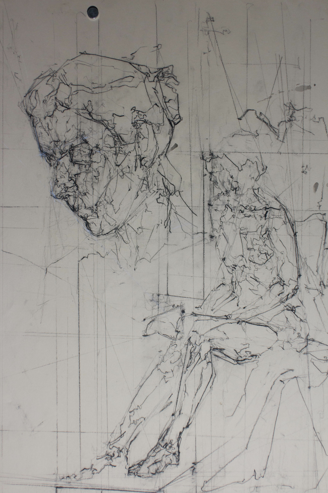
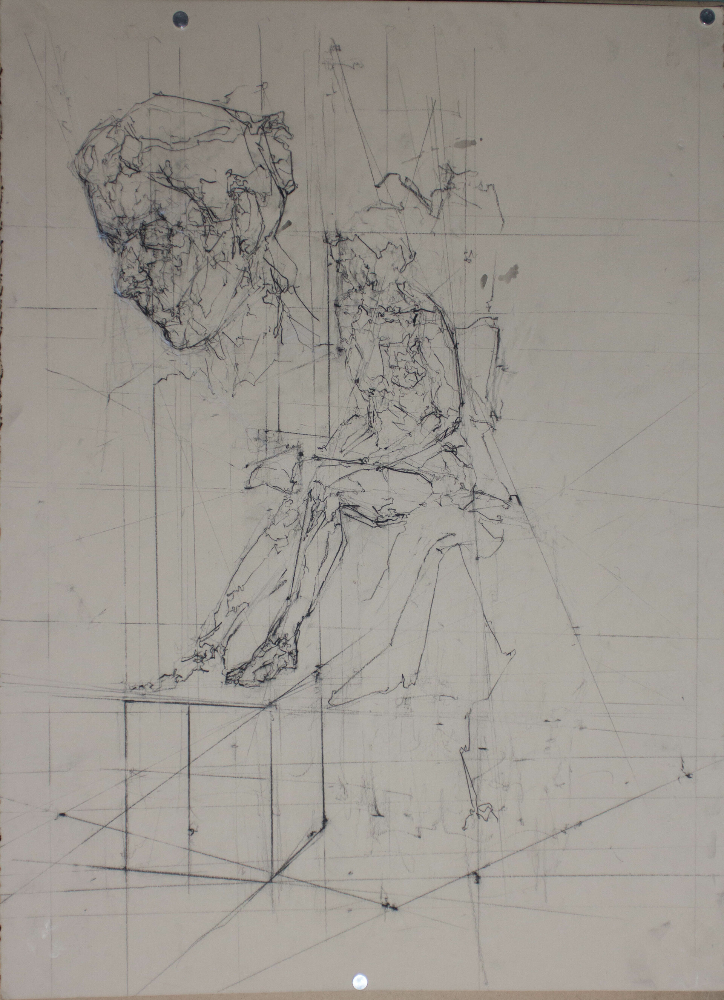

 

Study of a female from life in UCF contour done near the end of the summer A semester.

For anyone unfamiliar; Ucf style contour is Blind and Semi-blind contour focused on extreme concentration of desired information (in this case forms) tied together with intercross and done with with certain material usage. The focus is on questions, what order they are asked, how they are answered and how the answers are written. The goal, as with any form of stern observation, is to break down preconceived notions. I'll be making a blog post over the next few days describing Base UCF contour and how I use it.

