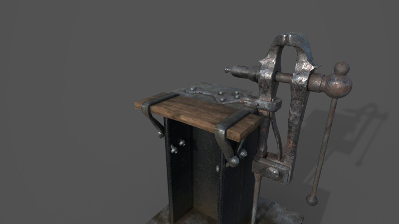

A game ready environment asset done for a quick turnaround project a couple years ago.

 <iframe title="Leg Vise and Bench" frameborder="0" allowfullscreen mozallowfullscreen="true" webkitallowfullscreen="true" allow="autoplay; fullscreen; xr-spatial-tracking" xr-spatial-tracking execution-while-out-of-viewport execution-while-not-rendered web-share src="https://sketchfab.com/models/1966ee4215dc4396bc86da6107e63d16/embed"> </iframe> 
 <a href="https://sketchfab.com/3d-models/leg-vise-and-bench-1966ee4215dc4396bc86da6107e63d16?utm_medium=embed&utm_campaign=share-popup&utm_content=1966ee4215dc4396bc86da6107e63d16" target="_blank" rel="nofollow" style="font-weight: bold; color: #1CAAD9;"> Leg Vise and Bench </a> by <a href="https://sketchfab.com/siewertlevi?utm_medium=embed&utm_campaign=share-popup&utm_content=1966ee4215dc4396bc86da6107e63d16" target="_blank" rel="nofollow" style="font-weight: bold; color: #1CAAD9;"> R. Levi Siewert </a> on <a href="https://sketchfab.com?utm_medium=embed&utm_campaign=share-popup&utm_content=1966ee4215dc4396bc86da6107e63d16" target="_blank" rel="nofollow" style="font-weight: bold; color: #1CAAD9;">Sketchfab</a>

