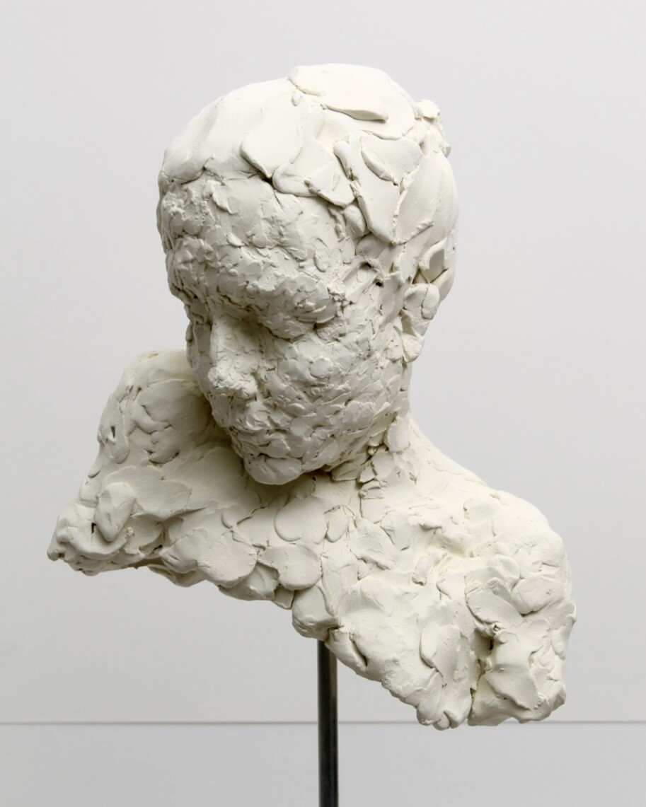

Abscond was a small bozetto/study done for a larger piece. It is now in a private collection.

2021

Ceramic, Steel, Slate

7” x 7” x 12”

<!-- COA Description:
Abscond was a core study that solidified thoughts and movements for a planned piece. It sits in reflection, mired in a insinuated form and battered by existence. -->